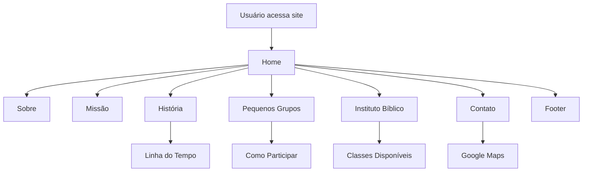

# IBP Next - Documentação Técnica

## Especificações Técnicas

### Tecnologias
- **Next.js** (React, SSR/SSG)
- **TypeScript**
- **TailwindCSS**
- **Lucide React**
- **Radix UI**
- **ESLint**

### Estrutura de Pastas
```
ibp-next/
├── public/
│   └── images/
├── src/
│   ├── app/
│   ├── components/
│   ├── lib/
│   └── styles/
├── package.json
├── tsconfig.json
├── tailwind.config.js
├── README.md
```

### Principais Componentes
- `HeroSection`: Banner principal
- `AboutSection`: Sobre a igreja
- `MissionSection`: Missão
- `ScrollReveal`: Animação de entrada
- `ContactSection`: Contato e Google Maps
- `Footer`: Rodapé

### Scripts
- `npm run dev`: Desenvolvimento
- `npm run build`: Build produção
- `npm run start`: Produção
- `npm run lint`: Lint

### Configuração
- **SSR/SSG**: Utiliza recursos do Next.js
- **Responsividade**: Layout adaptado para desktop e mobile
- **Acessibilidade**: Radix UI e boas práticas
- **Animações**: ScrollReveal
- **Rotas**: Baseadas em arquivos na pasta `src/app`

### Diagrama de Fluxo (Mermaid)


### Observações
- Imagens da linha do tempo devem seguir o padrão e resolução recomendados em `public/images/README.md`.
- Para adicionar eventos históricos, edite o array `events` em `src/app/historia/page.tsx`.
- Para personalizar estilos, edite `src/app/globals.css` e `tailwind.config.js`.
- Para deploy, recomenda-se Vercel.

---

Dúvidas técnicas? Consulte o README principal ou entre em contato com o responsável pelo projeto.
