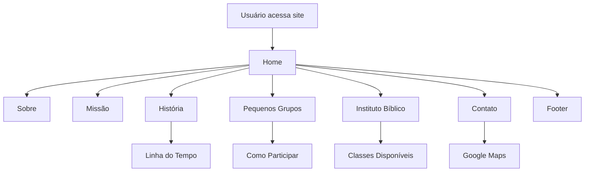

# IBP Next - Igreja Batista do Pirangi

## Visão Geral

Este projeto é o site institucional da Igreja Batista do Pirangi, desenvolvido com Next.js e React. O objetivo é apresentar informações sobre a igreja, sua história, missão, ministérios, pequenos grupos, Instituto Bíblico, contatos e programação, servindo como ponto de acolhimento, divulgação e comunicação para membros, visitantes e interessados.

## Funcionalidades

- **Página inicial**: Apresentação da igreja, missão, valores e convite à comunidade.
- **História**: Linha do tempo interativa com marcos históricos e imagens.
- **Pequenos Grupos**: Explicação, benefícios e como participar dos PGs.
- **Instituto Bíblico**: Informações sobre a Escola Bíblica Dominical, horários e classes.
- **Contato**: Endereço, e-mail, horários de culto e link para localização no Google Maps.
- **Footer**: Links rápidos e informações institucionais.

## Público-alvo

- Membros da igreja
- Visitantes e interessados
- Comunidade local

## Como rodar o projeto

```bash
npm install
npm run dev
```
Acesse [http://localhost:3000](http://localhost:3000) no navegador.

## Estrutura de Pastas

```
ibp-next/
├── public/
│   └── images/           # Imagens institucionais e linha do tempo
├── src/
│   ├── app/              # Páginas (historia, pg, instituto-biblico, etc)
│   ├── components/       # Componentes reutilizáveis (HeroSection, Footer, etc)
│   ├── lib/              # Funções utilitárias
│   └── styles/           # Estilos globais
├── package.json          # Dependências e scripts
├── tsconfig.json         # Configuração TypeScript
├── tailwind.config.js    # Configuração Tailwind
├── README.md             # Documentação
```

## Principais Componentes

- `HeroSection`: Banner principal com imagem e chamada.
- `AboutSection`: Sobre a igreja, valores e acolhimento.
- `MissionSection`: Missão institucional.
- `ScrollReveal`: Animação de entrada dos elementos ao rolar.
- `ContactSection`: Informações de contato e botão para Google Maps.
- `Footer`: Rodapé institucional.

## Scripts

- `npm run dev`: Inicia o servidor de desenvolvimento.
- `npm run build`: Gera a build de produção.
- `npm run start`: Inicia o servidor em produção.
- `npm run lint`: Verifica padrões de código.

## Tecnologias Utilizadas

- **Next.js** (React, SSR/SSG)
- **TypeScript**
- **TailwindCSS** (estilização)
- **Lucide React** (ícones)
- **Radix UI** (componentes acessíveis)
- **ESLint** (padronização de código)

## Deploy

Recomenda-se o deploy na Vercel para melhor performance e integração com Next.js.

## Contribuição

Sugestões e melhorias são bem-vindas!

---

## Diagrama de Fluxo


