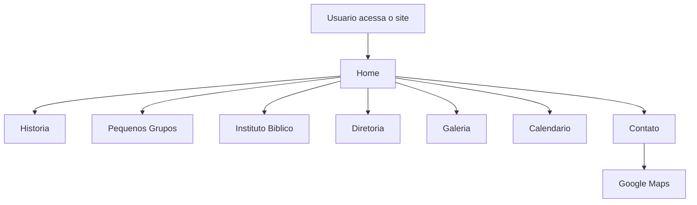

# IBP Next - Igreja Batista do Pirangi

Site institucional da Igreja Batista do Pirangi, desenvolvido com Next.js e TypeScript.

Site em produção: [https://somosibp.vercel.app/](https://somosibp.vercel.app/)

## Visão Geral

O projeto apresenta informações institucionais da igreja e reúne conteúdos para membros, visitantes e comunidade local, com foco em acolhimento, comunicação e divulgação.

## Funcionalidades

- Página inicial com apresentação da igreja
- História com linha do tempo e imagens
- Pequenos Grupos (PG)
- Instituto Bíblico
- Diretoria
- Galeria de fotos
- Calendário de eventos
- Seção de contato com endereço e localização

## Como rodar localmente

Pré-requisito: Node.js instalado.

```bash
npm install
npm run dev
```

Abra [http://localhost:3000](http://localhost:3000).

## Scripts

- `npm run dev`: inicia o servidor de desenvolvimento
- `npm run build`: gera a build de produção
- `npm run start`: inicia a aplicação em modo produção
- `npm run lint`: executa validação de lint

## Estrutura do projeto

```text
ibp-next/
├── public/
│   ├── images/                 # Imagens institucionais e da linha do tempo
│   └── logos_Ibp/              # Logos e variações
├── src/
│   ├── app/                    # Rotas e páginas (App Router)
│   │   ├── calendario/
│   │   ├── diretoria/
│   │   ├── galeria/
│   │   ├── historia/
│   │   ├── instituto-biblico/
│   │   └── pg/
│   ├── components/             # Componentes reutilizáveis
│   │   └── ui/                 # Componentes de base (botão, card, etc)
│   └── lib/                    # Utilitários
├── eslint.config.mjs
├── next.config.ts
├── postcss.config.mjs
├── tsconfig.json
└── README.md
```

## Tecnologias

- Next.js 16
- React 19
- TypeScript
- Tailwind CSS 4
- Radix UI
- FullCalendar
- ESLint

## Deploy

Deploy recomendado na Vercel.

## Contribuição

Sugestões e melhorias são bem-vindas.

## Fluxo de navegação (resumo)


```mermaid
flowchart TD
    A[Usuario acessa o site] --> B[Home]
    B --> C[Historia]
    B --> D[Pequenos Grupos]
    B --> E[Instituto Biblico]
    B --> F[Diretoria]
    B --> G[Galeria]
    B --> H[Calendario]
    B --> I[Contato]
    I --> J[Google Maps]
```
